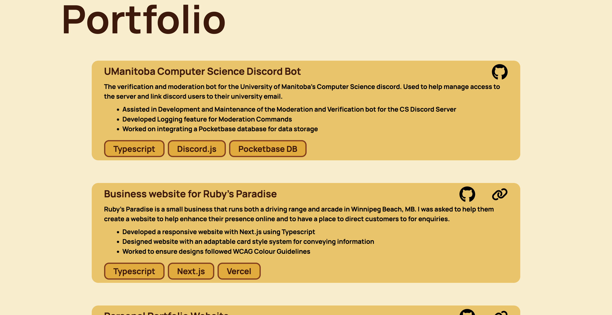

# Personal Portfolio Website
## About

This is the 2025 updated version of my portfolio showcasing the skills that I've learned on other projects using Next.js, TailwindsCSS, and React-Icons.


A big thing that I worked on with this site is trying to setup dynamic card components for my project cards. This allows me to dynamically create both the cards showcasing the technologies and the project cards themself using a json file - [projects.json](/src/data/projects.json)

This makes is super simple to add/modify/remove projects from my website, and will potentially allow me to link it with future projects.



## Running the Development Environment

You can launch a local version of this project by cloning it and then running

```bash
# install packages
bun install

# run dev environment
bun run dev
```

to start the development server and opening [http://localhost:3000](http://localhost:3000) to view it within your browser.

This project uses the font Array from [fontshare.com](https://www.fontshare.com/fonts/array) and Manrope from [fonts.google.com](https://fonts.google.com/specimen/Manrope).

## Running the Production Environment

Production builds are produced using Docker conatiners. You can adjust the port by either changing the port in `docker-compose.yml` or by passing in the option while establishing the container.

```bash
docker compose up -d
```

This will install everything that is required and bring up the container on port 3000 (or the manually defined port)
